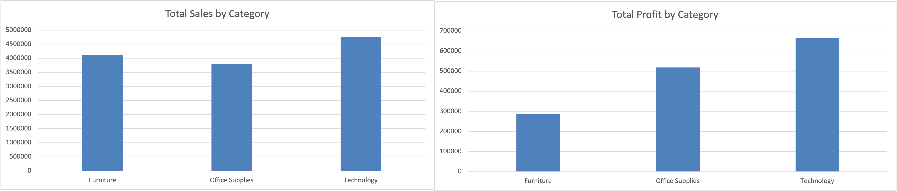

# # Superstore Data Analysis Project: Uncovering Business Insights with Excel

## 📊 Project Overview
This project involves an in-depth analysis of the Sample Superstore dataset using Microsoft Excel. The primary goal is to extract meaningful business insights from sales, profit, and customer data to understand performance drivers, identify areas for improvement, and inform strategic decision-making.

## 🎯 Objectives
The analysis addresses critical business questions across various dimensions, including:
* Assessing overall business performance (sales, profit).
* Evaluating the profitability and sales contribution of different product categories and sub-categories.
* Understanding geographical sales and profit distribution.
* Identifying trends and seasonality in sales over time.
* Analyzing customer behavior and identifying high-value customers.
* Investigating specific product performance and operational efficiency.

## 🗄️ Dataset
The project utilizes the well-known **Sample Superstore Dataset**, which contains detailed transaction records including sales, profit, order dates, customer information, product details, and geographical data.

## 🛠️ Tools & Technologies
* **Microsoft Excel:** The primary tool used for all data manipulation, analysis, and visualization. Key Excel features leveraged include:
    * **PivotTables:** For dynamic data summarization and aggregation.
    * **Calculated Fields:** To derive new metrics (e.g., Profitability Ratio, Average Price Per Unit).
    * **Formulas:** For various calculations and data transformations (e.g., DATEDIF for fulfillment time, SUMIFS for specific queries).
    * **Data Sorting & Filtering:** For isolating specific data points and identifying top/bottom performers.
    * **Conditional Formatting:** For visual emphasis on key trends or outliers (e.g., loss-making items).
    * **Charting:** To create compelling visual representations of data trends and comparisons.

## 📈 Key Analyses Performed & Insights Generated

### 1. Overall Performance Snapshot
* Calculated total sales, total profit, average order values, and min/max sales across the entire dataset.

### 2. Product Category & Sub-Category Performance
* **Profitability Ratio:** Analyzed the `Profit Ratio (Profit / Sales)` for each Category and Sub-Category to understand profit efficiency.
* **Top Sales Drivers:** Identified the top-performing sub-categories by sales volume and their contribution to overall sales.
* **Loss-Making Segments:** Pinpointed specific sub-categories incurring losses (e.g., 'Tables').
* **Average Unit Pricing:** Determined the average sales price per unit for each sub-category to understand product value points.

### 3. Geographical Insights
* **Regional & State Profitability:** Explored sales and profit performance across different regions and states, identifying high-performing and challenging geographical areas (e.g., focusing on losses in 'Lagos' within the 'Africa' region).
* **Unique Customer Distribution:** Identified states with the highest concentration of unique customers, crucial for targeted marketing.
* **Shipping Mode Preferences:** Analyzed the most frequently used shipping methods for specific product categories within certain regions (e.g., Technology in the Central Region).

### 4. Time-Based Trends
* **Quarterly & Annual Performance:** Conducted a year-over-year and quarter-over-quarter analysis of total sales and profit to identify growth trends and seasonal patterns.

### 5. Operational & Customer Behavior
* **Order Fulfillment Time:** Calculated the average days taken to ship orders, broken down by shipping mode, to assess logistical efficiency.
* **High-Value Customers:** Identified the top 10 customers by total sales, highlighting key revenue generators.
* *(Note: Analysis of Discount Impact and Data Gaps were partially explored/skipped in this phase but represent valuable next steps.)*
* **Specific Product Performance:** Queried sales and profit data for individual high-impact products (e.g., 'Canon imageCLASS 2200 Advanced Copier').

## 🖼️ Key Findings & Visualizations

### A. Sales & Profit Performance by Product Category
The analysis revealed significant differences in profitability across product categories, with some sub-categories being highly efficient while others incurred substantial losses.

### B. Sales & Profit Trends Over Time
The data shows clear overall growth and distinct seasonal patterns, crucial for forecasting and inventory management.

### C. Identifying Profit Challenges in Specific Regions
A critical geographical challenge was identified, with a particular state heavily contributing to overall losses.

### D. Operational Efficiency: Order Fulfillment Time
Understanding the average time taken for order fulfillment by shipping mode provides insights into logistics.

### E. Product Unit Pricing Breakdown
This analysis highlights the average selling price per unit across different product sub-categories, providing context for product value.

### F. Pinpointing Loss-Making Sub-Categories
Directly identifying product segments that are operating at a loss is crucial for strategic intervention.

## 📁 Workbook Structure
The Excel workbook is organized into the following 17 sheets for clarity and ease of navigation:

1.  `Analysis of Loss-Making Sub-Cateogry`
2.  `temp_data_sheet` (Often used for temporary calculations or data preparation steps)
3.  `Unique Customer Distribution`
4.  `Sales Trends`
5.  `sample_superstore_raw` (Likely your original raw data sheet)
6.  `Sub Category Analysis`
7.  `Discount Impact`
8.  `Product Performance Detail`
9.  `Top Customers`
10. `Average Order Value`
11. `Shipping Efficiency`
12. `Shipping Analysis`
13. `Regional Profitability`
14. `Product Unit Pricing`
15. `Top Sales Sub-Categories`
16. `Profit Ratios`
17. `Category Analysis`

## 🚀 Future Enhancements
* Conduct a deeper analysis into the root causes of loss-making sub-categories (e.g., 'Tables').
* Analyze the true impact of `Discount` levels on profitability by segmenting discount ranges (revisiting the skipped task).
* Explore `Customer Lifetime Value (CLTV)` or `Customer Segmentation` for more targeted marketing.
* Implement advanced forecasting models for sales.
* Develop a comprehensive, interactive dashboard leveraging Slicers and potentially Power Query-driven data models for dynamic insights.
* Automate repetitive tasks using basic VBA macros.

## 📧 Contact
Feel free to reach out for any questions or collaborations!
rohitprakash023@gmail.com
